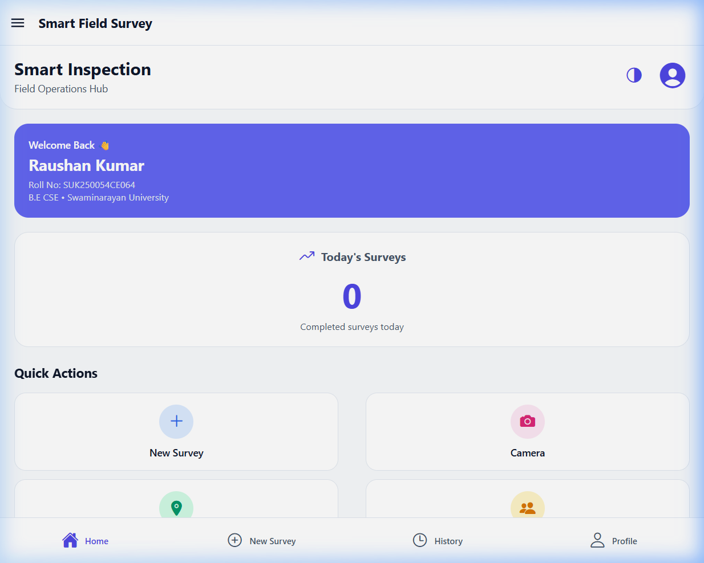
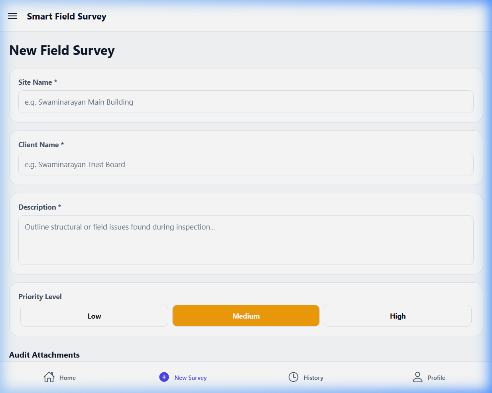
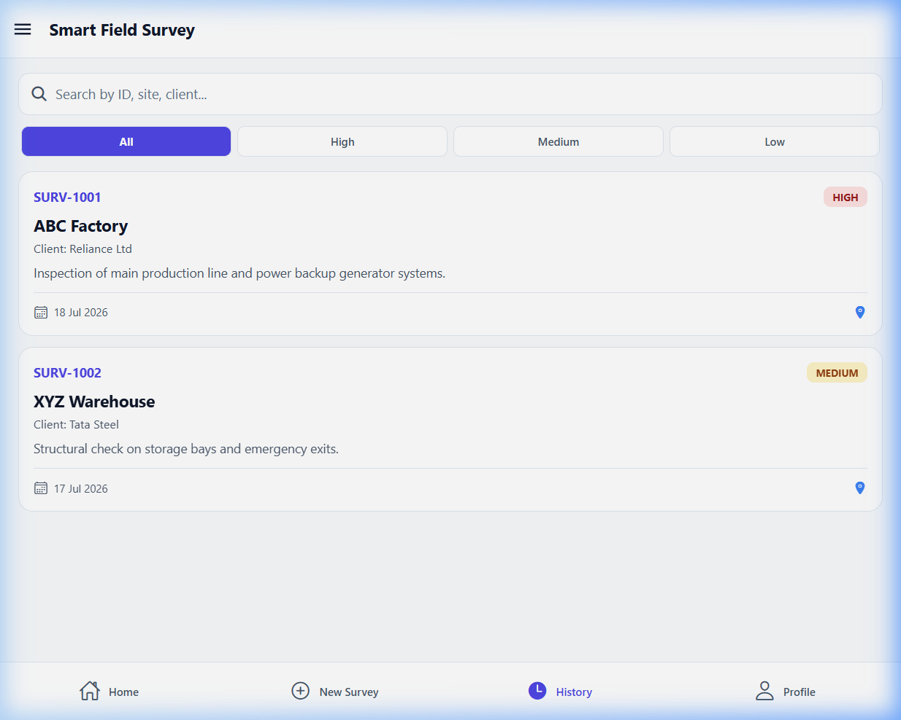
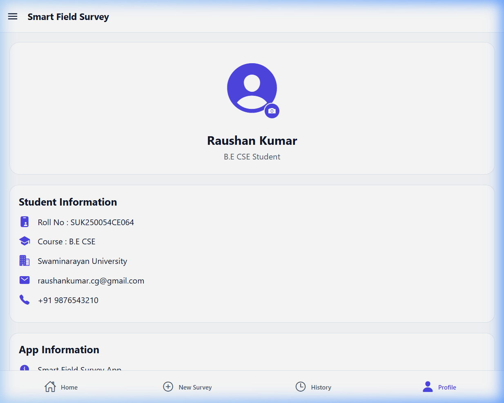

# Field Survey Mobile Application 📋📱

A modern, responsive, and offline-first React Native (Expo) mobile application designed for field researchers to collect survey data. The application features full local-storage caching, automatic sync mechanisms, custom themes, and advanced integrations with hardware APIs (GPS Location, Camera, Contacts, and Clipboard).

---

## 📸 Application Preview (Screenshots)

Below are the actual interface screenshots taken from the application:

### 1. Interactive Dashboard
*Displays real-time collection metrics, recent survey submissions, and active network connectivity status.*
<p align="center">
  
</p>

### 2. Survey Creation Form
*A fully-dynamic form supporting structured input validation, location capture, photo attachments, and offline storage preparation.*
<p align="center">
  
</p>

### 3. Survey History & Sync Status
*Lists all completed surveys stored on the device with real-time status indicators showing whether they are successfully synchronized or cached offline.*
<p align="center">
  
</p>

### 4. User Profile & Preferences
*Manage operator profiles, customize application colors, and configure system preferences.*
<p align="center">
  
</p>

---

## 🛠️ Key Features

* **Offline-First Storage:** Stores all surveys locally using `@react-native-async-storage/async-storage`. Works seamlessly in locations without network connectivity.
* **Auto-Sync Network Manager:** Listens to network state transitions. Automatically pushes pending local survey data to the sync stream when connection goes online.
* **Location & Geotagging:** Captures precise GPS coordinates (Latitude & Longitude) using `expo-location` to verify where surveys are conducted.
* **Camera Integration:** Directly capture photos on-site using `expo-camera` to attach evidence/photos to survey cards.
* **Contacts Integration:** Search and select target contacts using `expo-contacts` directly within the surveys.
* **Clipboard & Sharing:** Allows copying survey metadata directly to the system clipboard and sharing survey summaries via system sharing intent.
* **Aesthetic Theme Engine:** Supports Light and Dark modes matching system preferences or explicit overrides, built using modern glassmorphic card layouts.

---

## 🚀 Getting Started

### 1. Prerequisites
Ensure you have Node.js installed and Expo CLI environment ready.

### 2. Install dependencies
```bash
npm install
```

### 3. Run Locally
Run the Metro Bundler in development mode:
```bash
# To run on iOS Simulator
npm run ios

# To run on Android Emulator/Device
npm run android

# To run on Web Browser
npm run web
```

---

## 📦 How to Build the Android APK (No Play Store Required)

To build an `.apk` file that you can install directly on any Android device:

1. Install EAS CLI:
   ```bash
   npm install -g eas-cli
   ```
2. Log in to Expo:
   ```bash
   eas login
   ```
3. Run the preview build command:
   ```bash
   eas build --platform android --profile preview
   ```
4. Once completed, download the `.apk` file from the generated Expo link or scan the QR code to install.
